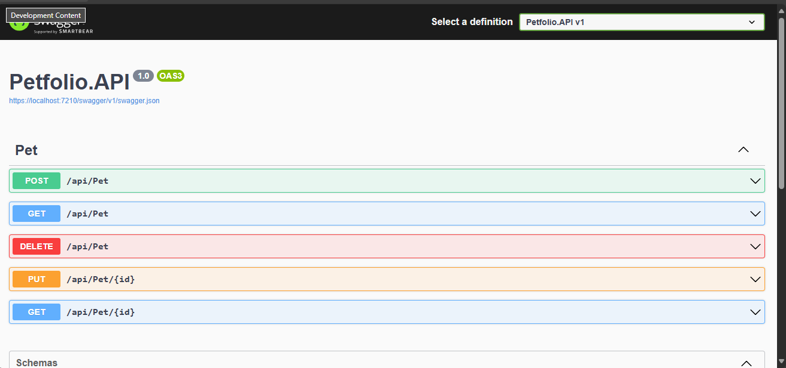

# Petfolio

Petfolio is an API built with ASP.NET Core developed in Visual Studio 2022 to manage pet information. The application allows you to register, update, list, obtain details and delete pets. Each pet has an ID, name, birthday and type (cat or dog).

<!-- image -->

    

## Features

- [x] Register Pet
- [x] Update Pet
- [x] List All Pets
- [x] Get Pet Details
- [x] Delete Pet

## What was used ?

The project was created on react

- [x] C#
- [x] .NET Core
- [x] Visual Studio versão 2022

## Meta

Author - Rockeseat.

programmer - [Fernando Futila] - fernando.futila@gmail.com

---

Done with 💜 by Fernando Futila 👋🏻
